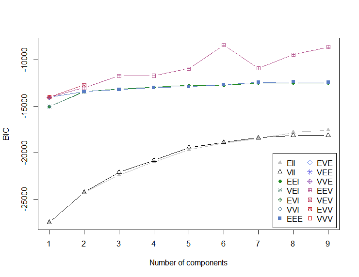

# A Knowledge-Based System for Breast Cancer Classification Using Fuzzy Logic Method

## Datasets overview:
Two datasets from the UCI Machine Learning Repository have been used in the implementation of this research paper.
• Wisconsin Diagnostic Breast Cancer (WDBC) dataset. It contains 569 instances. There are 32 attributes - https://archive.ics.uci.edu/ml/datasets/Breast+Cancer+Wisconsin+(Diagnostic)
• Mammographic mass (Elter et al., 2007) dataset. It contains 961 instances. And has 6 attributes - https://archive.ics.uci.edu/ml/datasets/Mammographic+Mass

## Process:
This paper has been selected to try out the actual real-life implementation of the algorithms learnt. Different algorithms are applied in different steps to the given datasets in an attempt to improve the prediction accuracy of breast cancer. This proposed knowledge-based system can be used as a clinical decision support system to assist medical practitioners in the health practice.
Various steps like clustering, noise removal and classification techniques are involved in the process to get the increased accuracy. They are,
<ul>
<li>Expectation Maximization (EM) is used as a clustering method to cluster the data in similar groups.</li>
<li>Classification and Regression Trees (CART) are used to generate the fuzzy rules to be used for the classification of breast cancer disease in the knowledge-based system of fuzzy rule-based reasoning method</li>
<li>To overcome the multi-collinearity issue, we incorporate Principal Component Analysis (PCA) in the proposed knowledge-based system.</li>
</ul>

## Study of different relevant methods

Different methods were studied and compared with this current method. It is to be noted that the Fuzzy Logic method had the most accuracy. The other methods studied were

### Classification accuracy on WBCD dataset

| Method                               | Accuracy |
|--------------------------------------|----------|
| PCA-KNN                              | 0.823    |
| PCA-SVM                              | 0.867    |
| Decision Tree (Lavanya and Rani,2011)| 0.929    |

### Classification accuracy on Mammographic mass dataset

| Method                | Accuracy |
|----------------------|----------|
| PCA-KNN              | 0.834    |
| PCA-SVM              | 0.896    |
| DT (Elter et al., 2007) | 0.838   |
| CBR (Elter et al., 2007) | 0.857   |
| ANN (Elter et al., 2007) | 0.847   |

## Implementation
### EM Clustering:

Clustering is done on the dataset and a set of 6 clusters is obtained as a result.  Bayesian Information Criterion was used in this process. The number of clusters obtained along with the original classes is shown in the figure below.

The BIC plot is shown below. The n value having the lowest BIC is taken as the optimum number of clusters.

### PCA:

Then PCA is performed on each of these clusters to reduce the dimensionality. Below are the plots for Principle Components from clusters 4 and 6 respectively.

Principle components PC1 and PC2 for cluster 4

Principle components PC1 and PC2 for cluster 6

### CART Algorithm:

After dimensionality reduction, decision trees are constructed for each of the clusters to obtain the set of rules to have as input for the Fuzzy Rule Based System. 

Decision tree for Cluster 4

Decision tree for cluster 5

Full tree attached separately

### Fuzzy rule-based System:

In the fuzzification step, Gaussian MFs are used to determine the degree of inputs that they belong to each of the appropriate fuzzy sets. Since there were no domain experts for us to provide the rules, approximate values were set for the Gaussian MFs and the fuzzy values were obtained. And the rules which were got from the CART algorithm was also fed as the input rule base for the fuzzy system. Mamdani model was used and the accuracy measure is given below.

## Conclusion:

The final phase of the paper, since there were no domain experts to set the actual gaussian values, we weren’t able to fully utilize the efficiency of the algorithm. But seeing the efficiency given in the research paper and in comparison, to the other methods, the Fuzzy Rule based system has proven to be very effective in predicting the Breast cancer with the given value. 